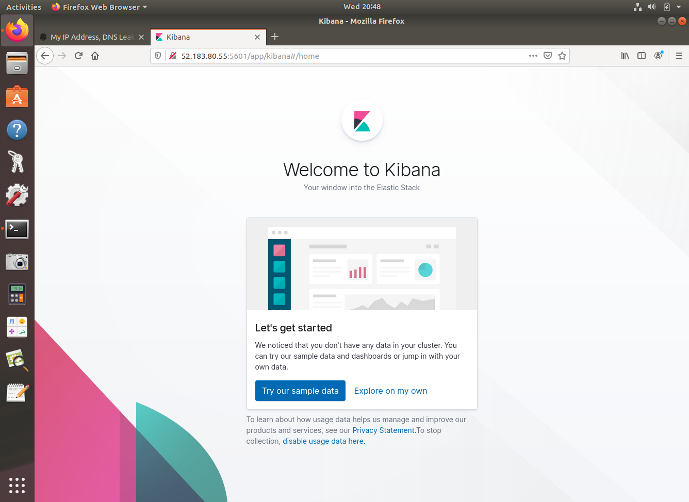
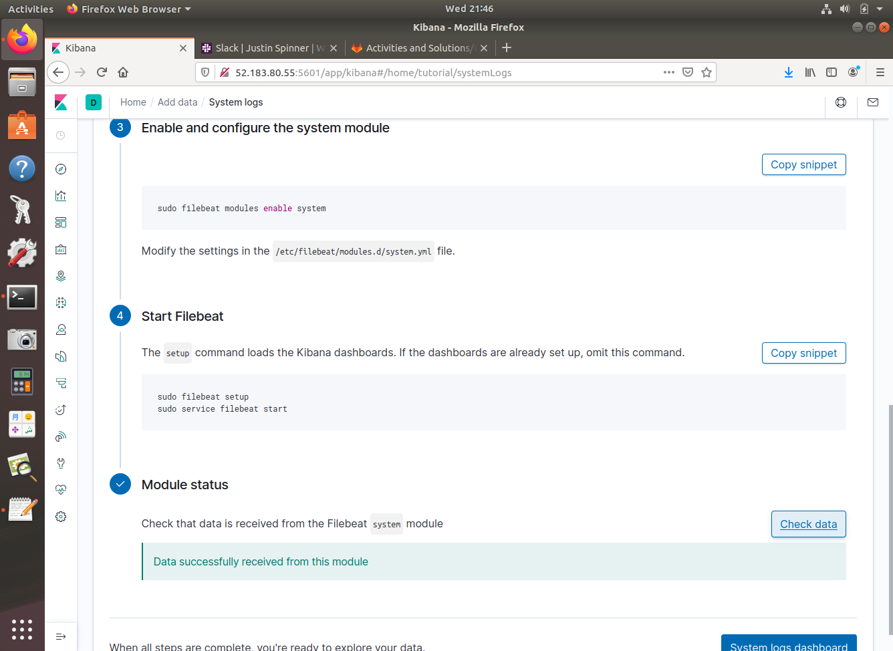
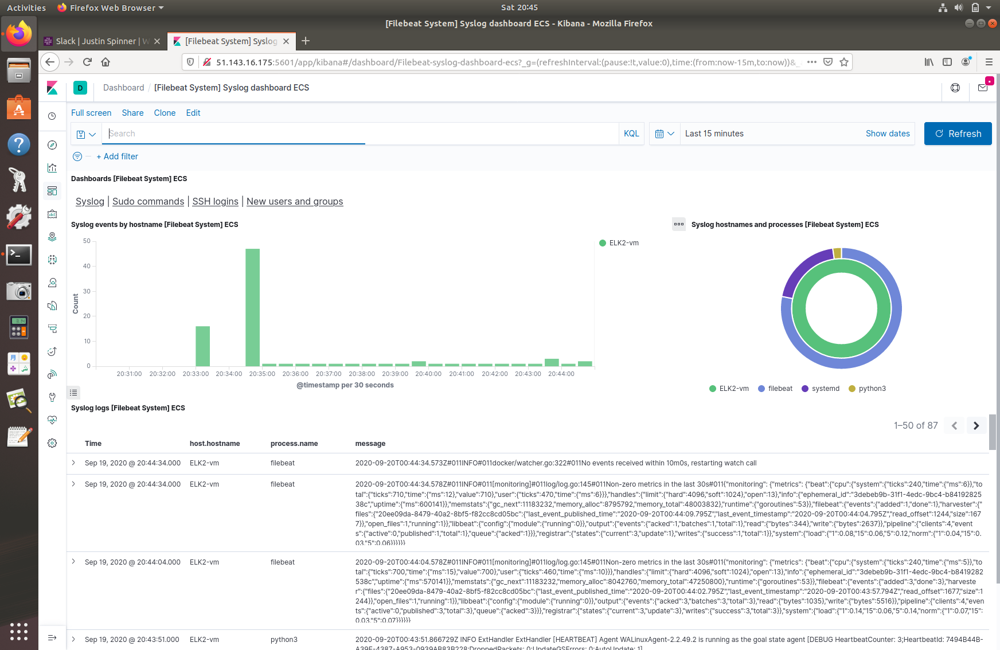
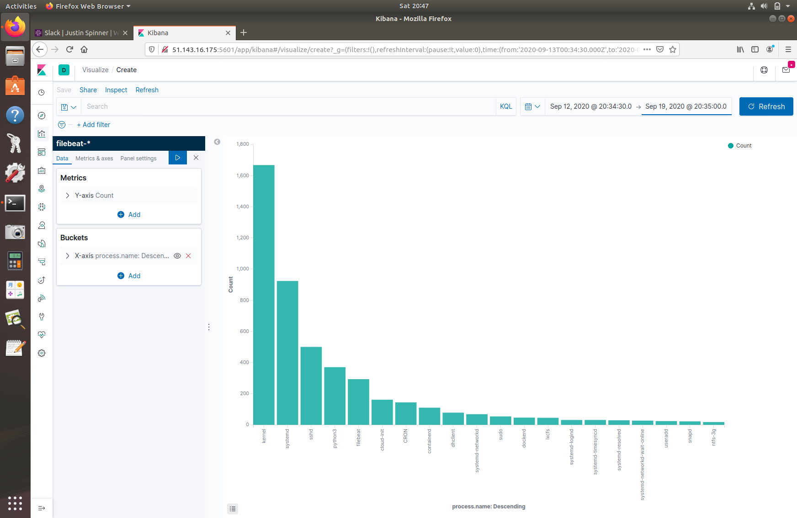

# Microsoft Azure ELK Stack

This repository showcases an ELK deployment using Microsoft Azure to monitor 2 web virtual machines backed by a load balancer.

The load balancer ensures the availability of the Web VM's, while the ELK VM is used to monitor the virtual machines.  First, a "**JumpBox**" virtual machine is configured so that we can provision each VM instance. The **JumpBox** acts as a secure gateway so that there is another network in-between our workstation and our deployed Web/ELK virtual machines.   


# Network Diagram


----
## Setup

Azure initial configuration info under *Setup* folder.

Virtual Machines:
1. Workstation 
    - shh-keygen, copy public key to JumpBox VM instance.
2. JumpBox - login via ssh from Workstation.  
    - shh-keygen, copy public key to Web3, Web4, & ELK VM instance.
3. Web3 - login via ssh from JumpBox
4. Web4 - login via ssh from JumpBox
5. ELK - login via ssh from JumpBox

----	
## Configuring JumpBox VM
* Linux, Ubuntu Server 18.04 LTS - Gen1
* Standard B1s, 1 GiB RAM, 1 vCPU
* Private IP: 10.1.0.7
* username: azadmin
* ssh-key: public key from Workstation VM

----
## Configuring Web3 VM
* Linux, Ubuntu Server 18.04 LTS - Gen1
* Standard B1s, 1 GiB RAM, 1 vCPU
* Private IP: 10.1.0.8
* username: azadmin
* ssh-key: public key from JumpBox/Ansible VM

----
## Configuring Web4 VM
* Linux, Ubuntu Server 18.04 LTS - Gen1
* Standard B1s, 1 GiB RAM, 1 vCPU
* Private IP: 10.1.0.9
* username: azadmin
* ssh-key: public key from JumpBox/Ansible VM

----
## Configuring ELK VM
* Linux, Ubuntu Server 18.04 LTS - Gen1
* Standard B2s, 4 GiB RAM, 2 vCPU's
* Private IP: 10.3.0.4
* username: azadmin
* ssh-key: public key from JumpBox/Ansible VM

----
## Ansible/Docker Setup
Ansible Files to use for setting up the DVWA and ELK web VM's:
- Ansible/pentest.yml
- Ansible/install-elk.yml
- Ansible/filebeat-playbook.yml
- Ansible/metricbeat-playbook.yml

Change: /etc/ansible/hosts
```
[webservers]
10.1.0.8 ansible_python_interpreter=/usr/bin/python3
10.1.0.9 ansible_python_interpreter=/usr/bin/python3

[elkservers]
10.3.0.4 ansible_python_interpreter=/usr/bin/python3
```

Change: /etc/ansible/ansible.cfg:
```
# default user to use for playbooks if user is not specified
# (/usr/bin/ansible will use current user as default)
remote_user = azadmin
```

----
# Kibana

## Kibana Welcome Screen


## Starting Filebeat

Navigate to the tutorial on Installing Filebeat and walkthrough the instructions from the ELK VM.
 ```
azadmin@ELK-vm: curl -L -O https://artifacts.elastic.co/downloads/beats/filebeat/filebeat-7.6.1-amd64.deb
azadmin@ELK-vm: sudo dpkg -i filebeat-7.6.1-amd64.deb
azadmin@ELK-vm: sudo filebeat modules enable system
azadmin@ELK-vm: sudo filebeat setup
azadmin@ELK-vm: sudo service filebeat start
```

----
# Filebeat Dashboard
## System Log and Processes


## Log of Processes by name


## Log of SSH Login attempts

